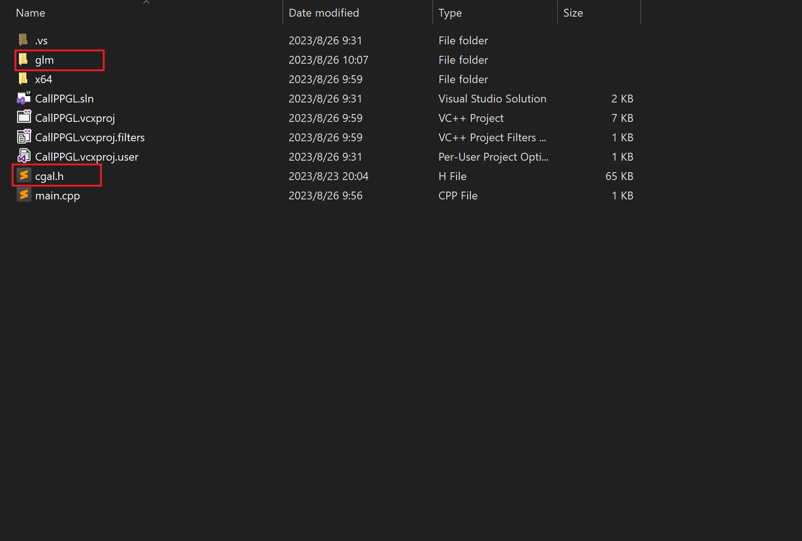
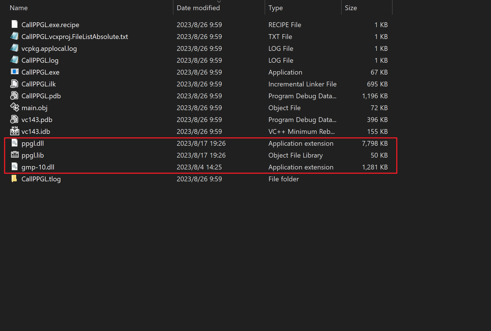
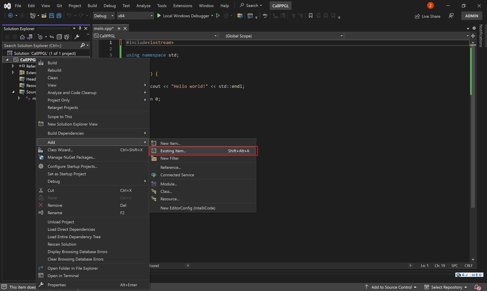
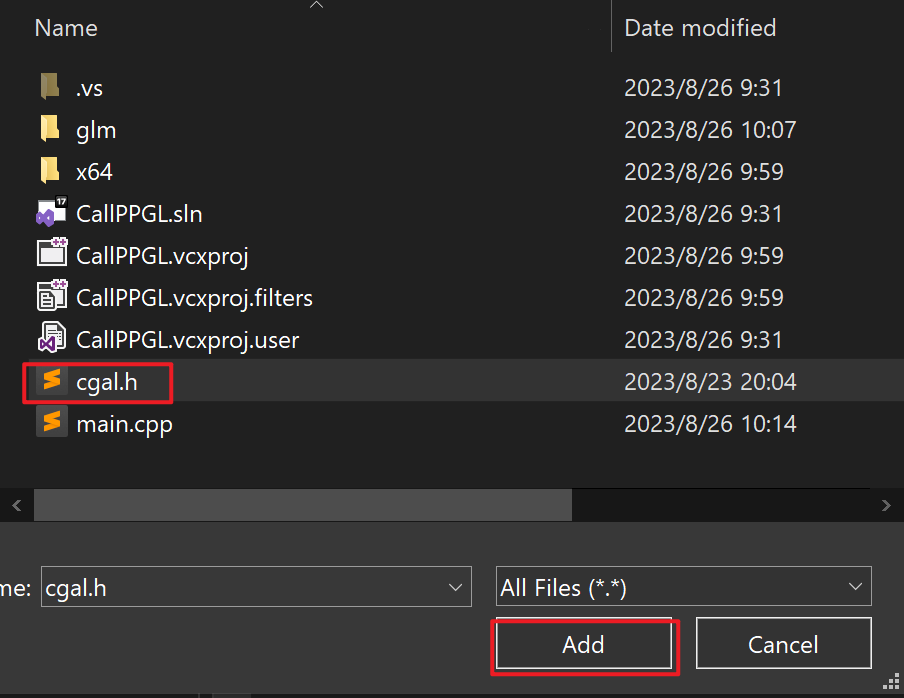
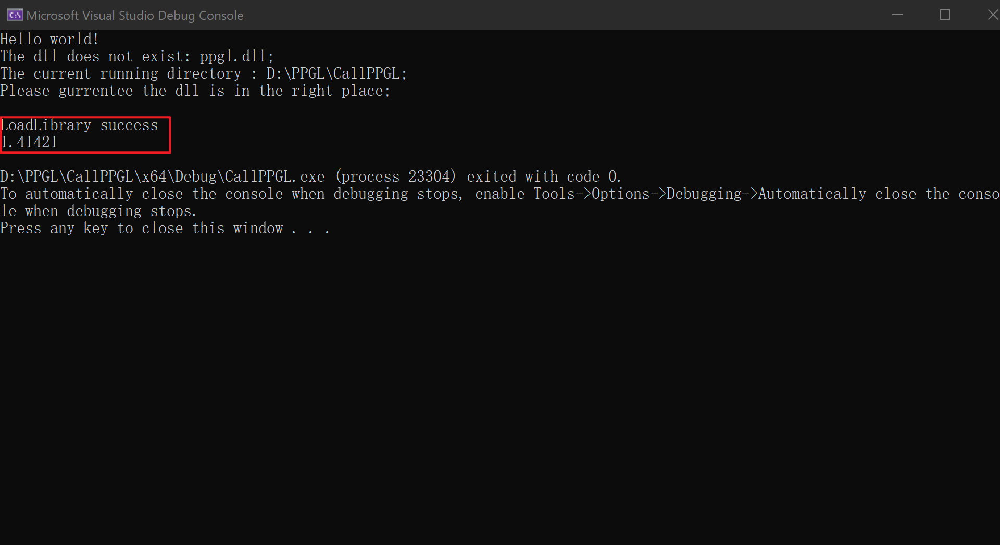

This repository is developed by Haisen Zhao. A set of fundamental geometric process functions are well organized based on some third-party library. 
Besides that, a set of commonly used functions are included. Currently, we release a dynamic link library file of "libhgp.dll". An example of using this library is in the example folder. 


# Contents

[Dependency](#Dependency)

[Develop LIBHGP](Develop%20libhgp.md)

[Call libhgp](#Call-libhgp)

​	[Prepare a project](#Prepare-a-project)  
​	[Copy libhgp](#Copy-libhgp )  
​	[Call libhgp in your project](#Call-libhgp-in-your-project)    

[License](#License)

# Dependency

You should install [CGAL](https://github.com/CGAL/cgal) before compiling this project. For Windows, recommend using vcpkg to install CGAL. 
Our project also depends on [glm](https://github.com/g-truc/glm.git) and [Clipper](http://www.angusj.com/delphi/clipper.php), but you don't need to install them explicitly.

# Call libhgp

If you already have a VS project, please start from "[Copy libhgp](Copy-libhgp)". Otherwise, follow these steps to create a new project.

## Copy libhgp 

- First, download this  repository "[libhgp](https://github.com/haisenzhao/libhgp)" to your computer.
- Open the "libhgp" folder and copy `libhgp.h` and "glm".
- Open the folder where your own project is located, then paste the files.
- Back to the "libhgp" folder, open the "Debug/Release/RelWithDebInfo" folder, and copy all files.
- Back to the folder where your project is located, and paste the files to your current working directory.

## Call libhgp in your project

- Right-click on your project in the "Solution Explorer" and select "Add" "Exsting item...". <br>

- Select "cgal.h" and click "Add".

- Use "cgal.h" in your code `#include"libhgp.h"`.
- Use namespace "libhgp": `using namespace libhgp;`.
- Add the following code to the main function to test libhgp.
  ```cpp
  auto a = PL().CGAL_2D_Distance_Point_Point_C(Vector2d(0, 0), Vector2d(1, 1));
  std::cerr << a << std::endl;
  ```
- Click "Local Windows Debugger". Seeing these words, it means that the run was successful.

# License

All rights about the program are reserved by the authors of this project. The programs can only be used for research purpose. In no event shall the author be liable to any party for direct, indirect, special, incidental, or consequential damage arising out of the use of this program.
