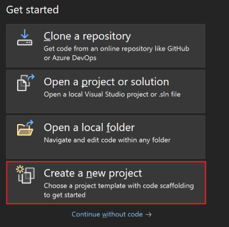
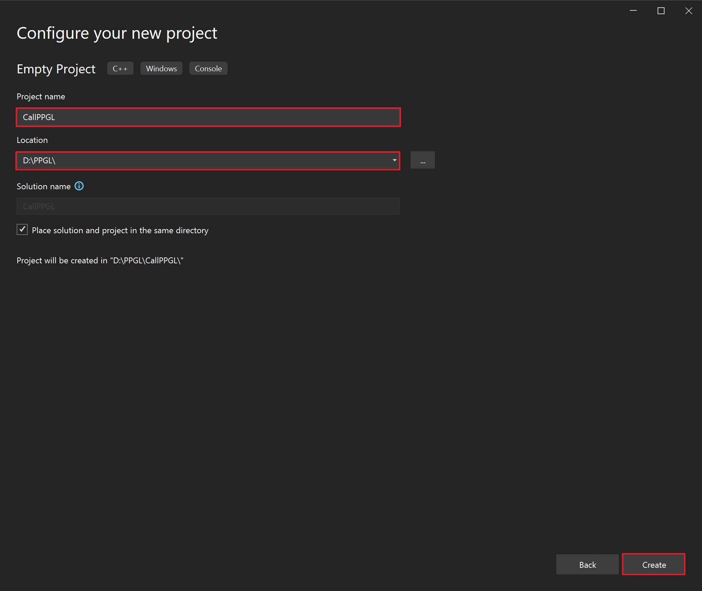
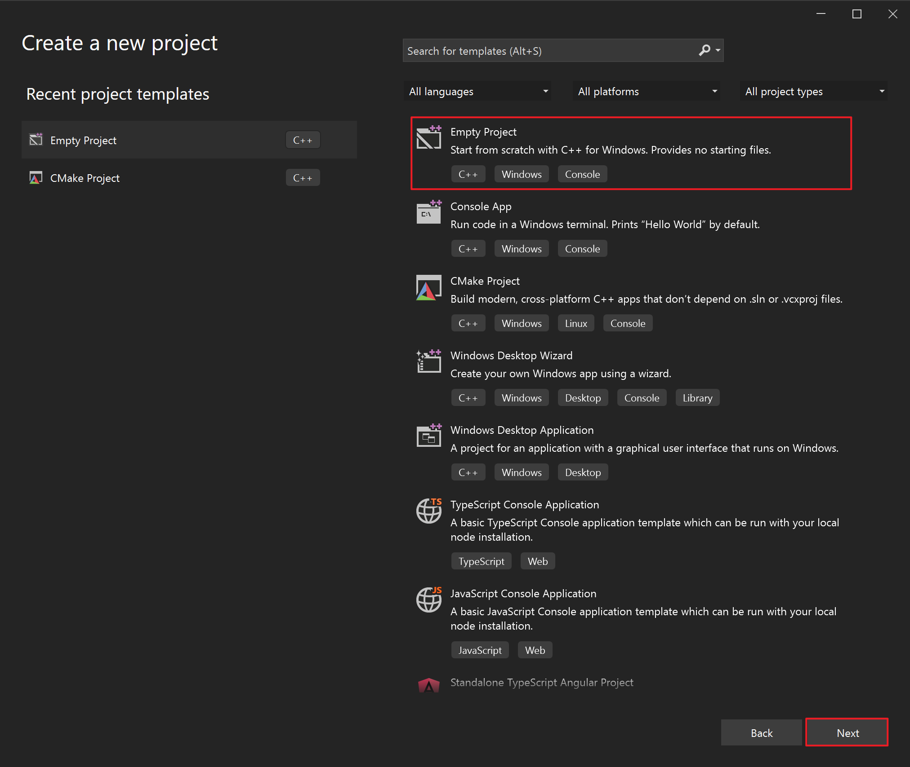
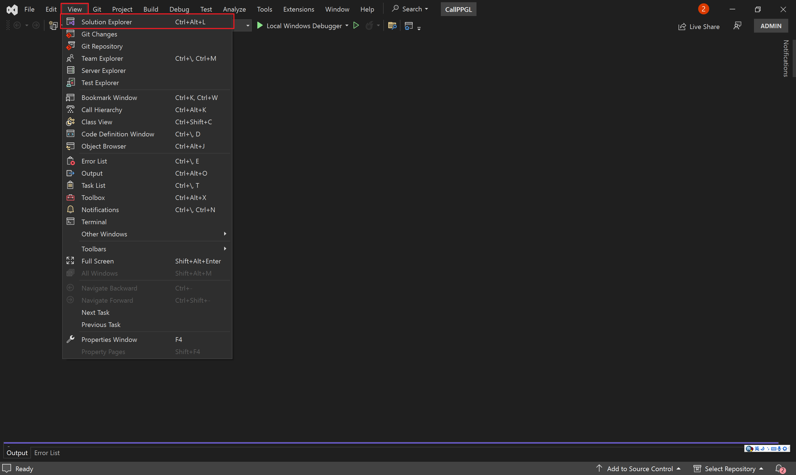
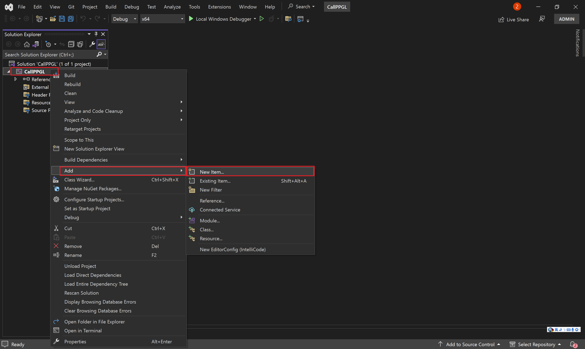
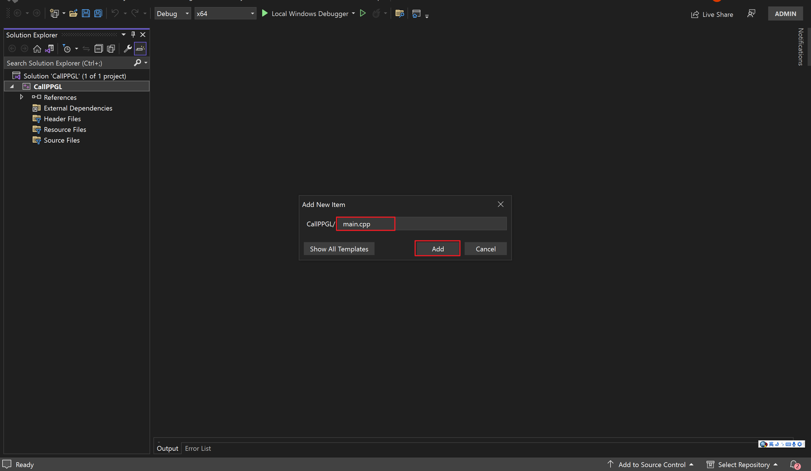
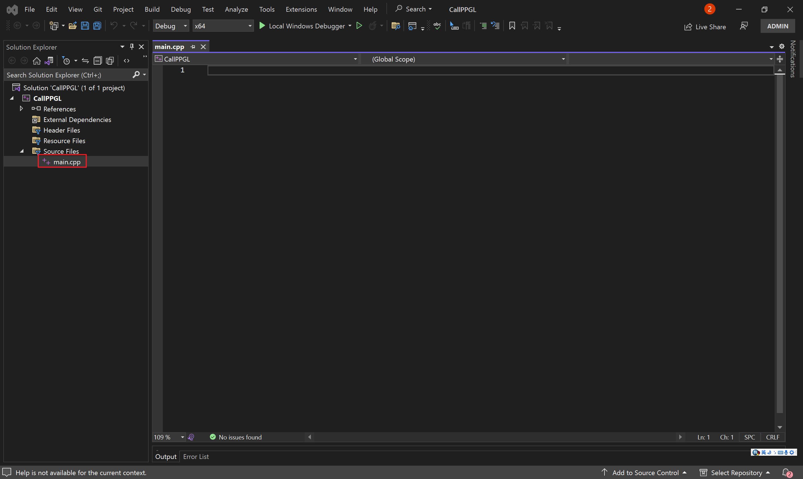
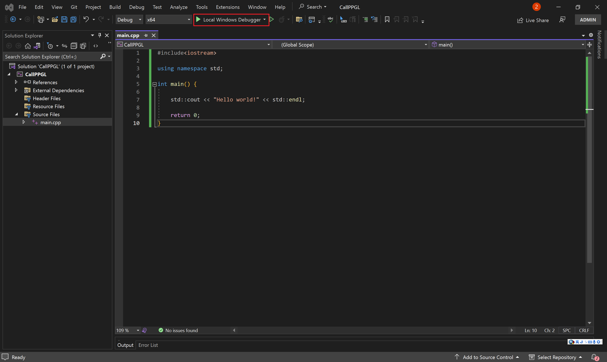
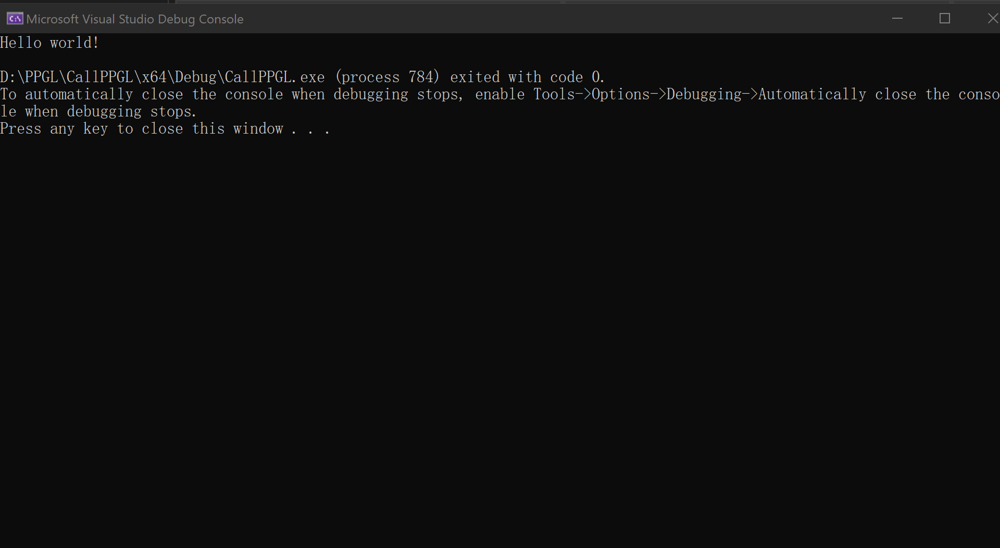

This repository is developed by Haisen Zhao for his research projects. A set of fundamental geometric process functions are well organized based on some third-party library. 
Besides that, a set of commonly used functions are included. Currently, we release a dynamic link library file of "ppgl.dll". An example of using this library is a port-example. 


# Contents

[Dependency](#Dependency)

[Develop PPGL](Develop%20PPGL.md)

[Call PPGL](#Call-PPGL)

​	[Prepare a project](#Prepare-a-project)  
​	[Copy PPGL](#Copy-PPGL )  
​	[Call PPGL in your project](#Call-PPGL-in-your-project)    

[License](#License)

# Dependency

You should install [CGAL](https://github.com/CGAL/cgal) before compiling this project. For Windows, recommend using vcpkg to install CGAL. 
Our project also depends on [glm](https://github.com/g-truc/glm.git) and [Clipper](http://www.angusj.com/delphi/clipper.php), but you don't need to install them explicitly.

# Call PPGL

If you already have a VS project, please start from "[Copy PPGL](Copy-PPGL)". Otherwise, follow these steps to create a new project.

## Prepare a project

- Open Visual Studio

- Click the "Create a new project" to create a new project.

- Then, select the "Empty Project" and click "Next".

- Name your project and choose the location you want to place. And then, click "create".

- Now, the project has been successfully created. Let's add an item to code.

- Click "View" on the menu bar, then click "Solution Explorer".

- Right-click on your project in the "Solution Explorer" and select "Add" "New item..."

- Name your item, then click "Add". 

- You will see a `.cpp` file in "Source File".

- Let's try to write some code and run it.

- Write the following code and then click "Local Windows Debugger".

  ```cpp
  #include<iostream>
  
  using namespace std;
  
  int main() {
  
      std::cout << "Hello world!" << std::endl;
  
      return 0;
  }
  ```

  

- Seeing these words, it means that the run was successful.

## Copy PPGL 

- First, download the folder "[port](https://github.com/haisenzhao/personal-pack-geom-lib/tree/master/port)" to your computer.
- Open the "port" folder and copy `cgal.h` and "glm".
- Open the folder where your project is located. Paste the file you just copied here.
- Back to the "port" folder, open the "Debug" folder, and copy all the files.
- Back to the folder where your project is located, open the "x64" folder, open the "Debug" folder, and paste the file you just copied here.

## Call PPGL in your project

- Right-click on your project in the "Solution Explorer" and select "Add" "Exsting item...". 

- Select "cgal.h" and click "Add".

- Use "cgal.h" in your code `#include"cgal.h"`

- Use namespace "PPGL": `using namespace PPGL;`

- Add the following code to the main function to test PPGL.


  ```cpp
  auto a = PL().CGAL_2D_Distance_Point_Point_C(Vector2d(0, 0), Vector2d(1, 1));
  std::cerr << a << std::endl;
  ```
- Click "Local Windows Debugger". Seeing these words, it means that the run was successful.


# License

All rights about the program are reserved by the authors of this project. The programs can only be used for research purpose. In no event shall the author be liable to any party for direct, indirect, special, incidental, or consequential damage arising out of the use of this program.
